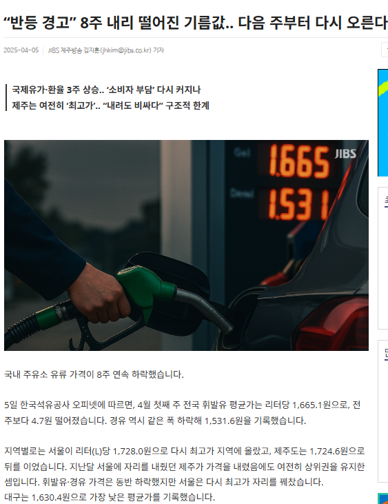
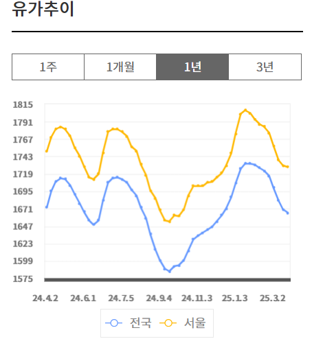
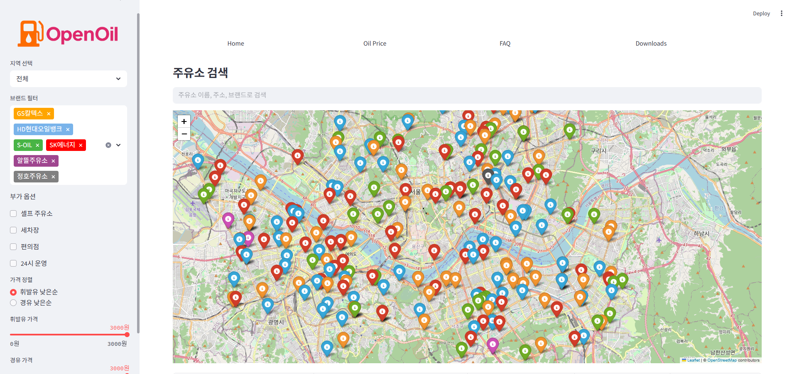
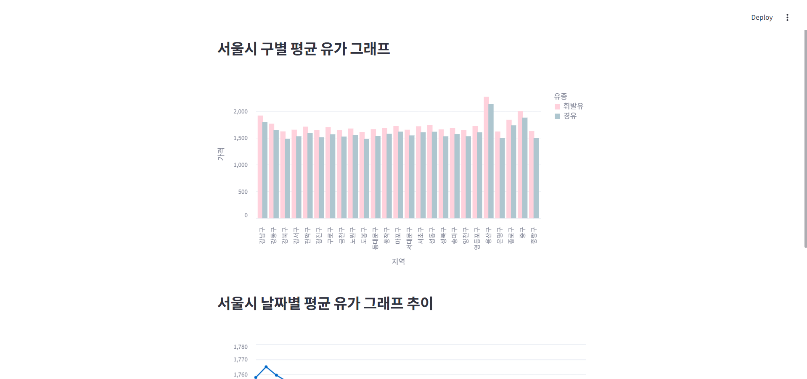
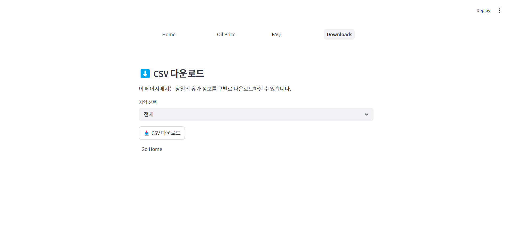
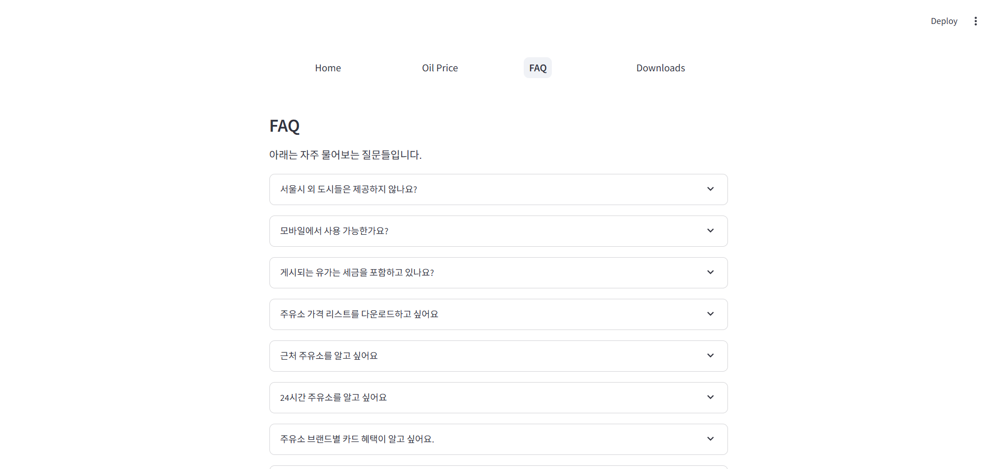
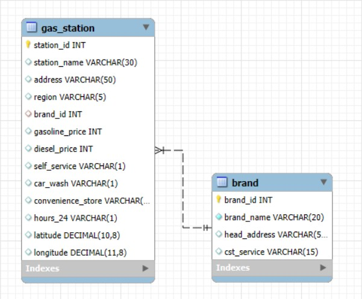

# :fuelpump:서울시 주유소 현황 및 관련 정보 제공 시스템

## 팀명

## 팀원 소개
| 팀장 | 팀원 | 팀원 | 팀원 | 팀원 |
|------|------|------|------|------|
|  <br> 이명인 [](https://github.com/leemyeongin2416) |  <br> 김동욱 [](https://github.com/boogiewooki02) |  <br> 민경재 [](https://github.com/rudwo524) |  <br> 박수빈 [](https://github.com/subin0821) |  <br> 지형우 [](https://github.com/JI0617) |
| PL / Database | Crawling / FE | Crawling / FE | Crawling / FE  | DB / FE |

## :memo:목차
- 프로젝트 개요
- 프로젝트 구성
- 주요 기능 설명
- 서비스 화면 구성
- 데이터 관리 (ERD)
- 수행 결과
- 팀원 별 회고

## 1. 프로젝트 개요
### 1.1 프로젝트 소개
- 서울시 주유소의 실시간 유가 정보와 다양한 부가 정보를 제공하는 시스템을 개발
- 사용자들은 이 서비스를 통해 최적의 주유소를 찾고, 유가 동향을 파악할 수 있음

### 1.2 동기
- 변동성이 많은 유가로 유가 상승시에 '소비자' 부담이 커짐
- 기름값은 지역별, 주유소별로 차이가 있기 때문에 어디서 주유하느냐에 따라서 비용을 절약할 수도 낭비할 수도 있음
- 이에 각 지역별, 주유소별 가격 비교 및 위치 정보 제공 고객센터 대표번호 및 부가 시설에 따른 정보를 한번에 확인 가능하다면 현명한 소비가 가능할 것이라고 생각하여 제작

### 1.3 관련 뉴스 기사
<div style="display: flex; justify-content: space-between;">
    
    
</div>

https://news.mt.co.kr/mtview.php?no=2024102414265992659

### 1.4 프로젝트 목표
- 석유공사가 운영하는 유가정보 서비스를 바탕으로 서울시 내의 400여개 주유소의 실시간 판매가격 및 부가시설 정보를 제공
- 위치정보 기반으로 상세위치 정보 제공 및 고객센터 정보 제공
- 날짜별 유가 추이 통계 제공
- 주유소 및 제공서비스 관련 FAQ 조회 시스템 제공

## 2. 프로젝트 구성
### 2.1 기술 스택
| 분류 | 기술 |
|------|------|
| 언어 |  |
| 웹크롤링 |  |
| 데이터저장 |  |
| 데이터 시각화 |  |
| 화면구현 |    |

### 2.2 프로젝트 구조
```
SKN13-1st-3Team/
├── README.md
├── streamlit/
│   ├── .streamlit/
│   ├── pages/
│   │   ├── home.py
│   │   ├── download.py
│   │   ├── faq.py
│   │   ├── graphs.py
│   │   └── __pycache__/
│   ├── app.py
│   ├── geocode.py
│   ├── __main__.py
│   └── openoil.png
├── crawling/
│   ├── crawling.py
│   └── [날짜].csv
└── Insert.ipynb
```

### 2.3 기능적 요구사항
|ID|요구사항 설명|
|------|---|
|FR-01|사용자에게 주유소 정보를 시각화하여 지도에 표시해야 함|
|FR-02|사용자는 지역(구), 브랜드, 가격 범위 등을 기준으로 필터링할 수 있어야 함|
|FR-03|사용자는 주유소 이름, 주소, 브랜드로 검색할 수 있어야 함|
|FR-04|사용자는 필터링된 주유소 목록을 CSV 파일로 다운로드할 수 있어야 함|
|FR-05|지역별 평균 휘발유 및 경유 가격을 바차트로 시각화해야 함|
|FR-06|날짜별 평균 휘발유 및 경유 가격을 꺾은선 그래프 시각화해야 함|
|FR-07|FAQ 페이지를 통해 자주 묻는 질문에 대한 답변을 제공해야 함|
|FR-08|페이지 간 이동은 네비게이션 바 및 '홈으로 가기' 버튼으로 구현되어야 함|
|FR-09|지도 위 주유소 마커는 브랜드별로 구분된 색상으로 표시되어야 함|

### 2.4 비기능적 요구사항
|ID|요구사항 설명|
|------|---|
|NFR-01|대시보드는 초기 로딩 시 5초 이내에 화면을 출력해야 함|
|NFR-02|필터 적용시 로딩이 3초 이내에 되어야 함|
|NFR-03|데이터는 MySQL 서버에서 실시간으로 불러와야 하며, 업데이트 주기는 1일임|
|NFR-04|대시보드는 PC 환경에 최적화되어야 함|

## 3. 주요 기능 설명
### 3.1 데이터 수집 및 관리
- 오피넷(https://www.opinet.co.kr)에서 서울시 25개 구별 데이터 수집
- Selenium을 이용한 자동화된 데이터 수집
- 일별 CSV 파일 저장 및 MySQL DB 연동
- 기본 정보(주유소명, 주소, 브랜드, 지역) 수집
- 가격 정보(휘발유, 경유) 수집
- 부가 정보(셀프, 세차, 편의점, 24시간 영업 유무) 수집

### 3.2 주유소 검색 및 지도 표시
- 서울시 25개 구별 주유소 검색
- 지도에 주유소 위치 표시 (브랜드별 색상 구분)
- 휘발유/경유 가격 오름차순 정렬
- 브랜드별 필터링 (GS칼텍스, SK에너지, S-OIL 등)

### 3.3 데이터 시각화
- 구별 평균 유가 막대 그래프
- 날짜별 유가 변동 추이 라인 그래프

### 3.4 부가 기능
- 셀프/세차장/편의점/24시간 운영 필터링
- 주유소 이름/주소/브랜드 검색
- CSV 형식 데이터 다운로드
- FAQ 페이지 제공

> 모든 기능은 Streamlit으로 구현되었으며, MySQL 데이터베이스와 연동되어 데이터를 제공함

## 4. 서비스 화면 구성
### 4.1 메인 페이지
<div style="display: flex; justify-content: center;">
    
</div>

- 지도 영역
  - geopy와 folium 라이브러리 활용한 위치 시각화
  - 주유소 위치 마커 표시 (브랜드별 색상 구분)
  - 마커 클릭 시 상세

- 주유소 목록
  - 필터링 및 정렬된 데이터 테이블 형태로 제공
  - 가격, 브랜드, 주소 등 주요 정보 표시

- 사이드바
  - 지역 선택 (25개 구)
  - 브랜드 필터
  - 부가 서비스 필터 (셀프/세차/편의점/24시간)
  - 가격 범위 설정

- 검색 영역
  - 주유소 이름/주소/브랜드 통합 검색
  - 실시간 검색 결과 반영

### 4.2 유가 정보 페이지
<div style="display: flex; justify-content: center;">
    
</div>

- 구별 평균 유가 막대 그래프
- 날짜별 가격 변동 추이 라인 그래프

### 4.3 부가 기능 페이지
<div style="display: flex; justify-content: space-between;">
    
    
</div>

- CSV 데이터 다운로드
- FAQ 정보 제공

> 모든 화면은 반응형으로 구현되어 있으며, 실시간 데이터 업데이트를 지원함

## 5. 데이터 관리 (ERD)


### 5.1 brand 테이블 (브랜드 정보)
| 필드명 | 데이터 타입 | 설명 | 제약조건 |
|--------|------------|------|----------|
| brand_id | INT | 브랜드 고유 식별자 | PRIMARY KEY |
| brand_name | VARCHAR(50) | 브랜드 이름 (GS칼텍스, SK에너지 등) | NOT NULL |
| head_address | VARCHAR(200) | 본사 주소 | |
| cst_service | VARCHAR(20) | 고객센터 전화번호 | |

### 5.2 gas_station 테이블 (주유소 정보)
| 필드명 | 데이터 타입 | 설명 | 제약조건 |
|--------|------------|------|----------|
| station_id | INT | 주유소 고유 식별자 | PRIMARY KEY |
| station_name | VARCHAR(100) | 주유소 이름 | NOT NULL |
| address | VARCHAR(200) | 주유소 주소 | NOT NULL |
| region | VARCHAR(20) | 지역구 정보 | NOT NULL |
| brand_id | INT | 브랜드 테이블과의 관계를 위한 외래키 | FOREIGN KEY |
| gasoline_price | INT | 휘발유 가격 | |
| diesel_price | INT | 경유 가격 | |
| self_service | CHAR(1) | 셀프여부 (Y/N) | |
| car_wash | CHAR(1) | 세차장 여부 (Y/N) | |
| convenience_store | CHAR(1) | 편의점 여부 (Y/N) | |
| hours_24 | CHAR(1) | 24시간 운영 여부 (Y/N) | |


